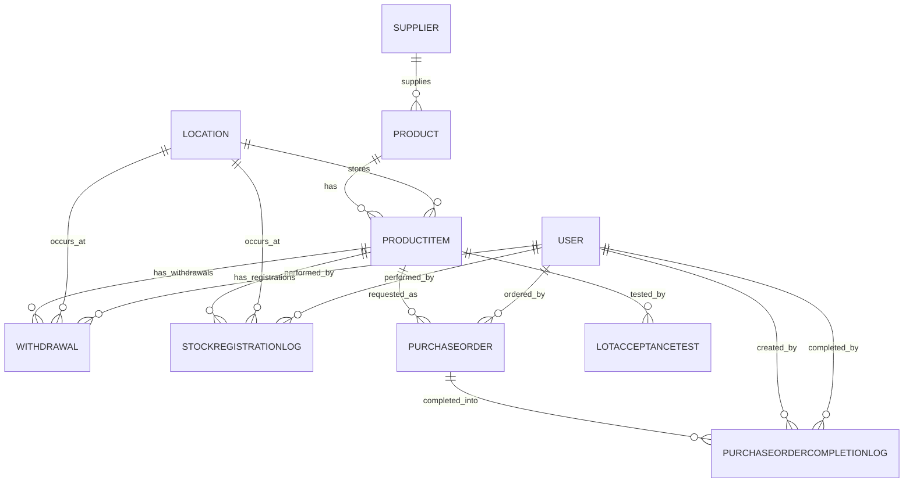
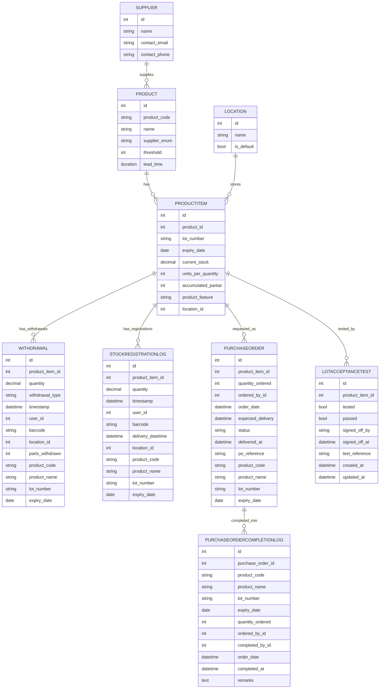

## 📦 Inventory Management Data Model

The system is built around products, their lot-level items, and stock movements (withdrawals, registrations, purchase orders, and QA checks).  
Below is the entity–relation diagram of the core data structures:

